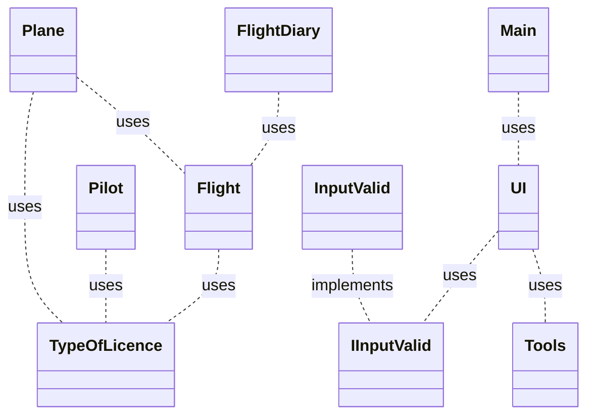

##### Termín: 25. 5. 2022 #####

###### Semestrální práce ######
[🖥️Prezentace](https://github.com/TomasKulhavy/2122ALG2-kulhavy-zapisnik-letu/blob/master/prezentace/2122ALG2-kulhavy-zapisnik-letu.pdf)
[📃Dokumentace](https://github.com/TomasKulhavy/2122ALG2-kulhavy-zapisnik-letu#readme)
- [Zadání práce](https://github.com/TomasKulhavy/2122ALG2-kulhavy-zapisnik-letu#zad%C3%A1n%C3%AD-pr%C3%A1ce)
  - [Popis problému (motivace)](https://github.com/TomasKulhavy/2122ALG2-kulhavy-zapisnik-letu#popis-probl%C3%A9mu-motivace)
- [Řešení](https://github.com/TomasKulhavy/2122ALG2-kulhavy-zapisnik-letu#%C5%99e%C5%A1en%C3%AD)
  - [Funkční specifikace](https://github.com/TomasKulhavy/2122ALG2-kulhavy-zapisnik-letu#funk%C4%8Dn%C3%AD-specifikace)
  - [Popis struktury vstupních a výstupních souborů](https://github.com/TomasKulhavy/2122ALG2-kulhavy-zapisnik-letu#popis-struktury-vstupn%C3%ADch-a-v%C3%BDstupn%C3%ADch-soubor%C5%AF)
  - [Class diagram](https://github.com/TomasKulhavy/2122ALG2-kulhavy-zapisnik-letu#class-diagram)
- [Popis fungování externích knihoven](https://github.com/TomasKulhavy/2122ALG2-kulhavy-zapisnik-letu#popis-fungov%C3%A1n%C3%AD-extern%C3%ADch-knihoven)
  - [Použití externí knihovny](https://github.com/TomasKulhavy/2122ALG2-kulhavy-zapisnik-letu#pou%C5%BEit%C3%AD-extern%C3%AD-knihovny)
- [Požadavky](https://github.com/TomasKulhavy/2122ALG2-kulhavy-zapisnik-letu#funk%C4%8Dn%C3%AD-a-technick%C3%A9-po%C5%BEadavky-na-aplikaci)

# Zápisník letů

## Zadání práce

- ### **Popis problému (motivace)**
    - Zápisník letů bude umožňovat uživateli si zapisovat lety, které budou ukládány do textové souboru. A následně je
      bude moc vyexportovat do PDF.
        - Místo startu / přistání
        - Čas vzletu / přistání
        - Celková doba letu
        - Počet startů
        - Typ startu
        - Typ letu
        - Velitel letadla
        - Typ letadla
        - Registrace letadla
    - Uživatel může lety načíst, filtrovat a řadit. Zobrazit celkové součty hodin a startů
    - Uživatel může vytvářet své zápisníky letů pro větroně, ultralighty nebo motorové letadla.
    - Uživatel může načíst deníky letadel ze souboru
    - Údaje v denících letadel budou různé od typu letadla (větroň, ultralight, motorové letadlo)

## Řešení

- ### **Funkční specifikace**
    - Po spuštění programu se uživatel musí přihlásit tím, že zadá své jméno a příjmení. Pokud zadá `0` program se
      vypne. Dále program podle toho, jestli již existuje či nikoliv založí soubor (.profile).
    - Uživateli zobrazí menu, kde si vybírá z následujících bodů:
        - `1.` Pridat typ zapisniku letu - zobrazí se list možných licencí, ze kterých si pilot vybere a ta se uloží do
          souboru pilota
        - `3.` Pridat let - pilot vyplní všechny potřebné informace o letu a následně tento let program přidá do souboru
          daného zápisníku
        - `3.` Pridat letadlo - pilot vytvoří letadlo, zadá název, registraci a typ licence a poté se vytvoří příslušný
          soubor
        - `4.` Zobrazit zapisnik - zobrazí se výpis licencí, které pilot má. Po zvolení licence se vypíše zápisník letů,
          který může následně řadit sestupně nebo vzestupně podle datumu
        - `5.` Zobrazit zapisnik letadla - zobrazí se výpis letadel. Po zvolení letadla se vypíše zápisník letů, který
          může následně řadit sestupně nebo vzestupně podle datumu
        - `0.` Odhlasit se - pokud uživatel zadá `0` tak se z programu odhlásí a může se znovu přihlásit nebo může
          program opustit

    - Ve 4. a 5. výběru se uživateli zobrazí menu, kde si vybírá z následujících bodů:
      - `1.` Seradit sestupne podle datumu - lety se seřadí podle datumu sestupně
      - `2.` Seradit vzestupne podle datumu - lety se seřadí podle datumu vzestupně
      - `3.` Exportovat do PDF - daný zápisník letů se vyexportuje do PDF souboru
      - `0.` Odhlasit se - pokud uživatel zadá `0` tak se dostane zpět do hlavní nabídky
      
- ### **Popis struktury vstupních a výstupních souborů**
    - [Soubory (data store)](./data/exported-data)
    - Údaje jsou uloženy v textovém souboru a jsou odděleny `, `
    - Program si přečte všechny soubory s letovými deníky letadel `(.plane)`, pilotů `(.ULL, .SPL, .PPL)` a také účty
      pilotů `(.profile)`
    - Pokud uživatel neexistuje tj. nemá svůj soubor, program mu tento soubor vytvoří `jmeno_prijmeno.profile`
    - Když si pilot založí svůj zápisník letů, vytvoří se soubor `jmeno_prijmeni.typlicence [ULL, SPL, PPL]`
    - Pokud uživatel vytvoří letadlo, program vytvoří soubor `registrace_letadla.plane`
    - Program dále s těmito soubory program pracuje tak, že je načítá a vypisuje do konzole nebo upravuje, pokud
      přidáváme lety.

    - **Zápisník ULL letadla**
  ``` txt
    typ letadla, typ licence, registracem celkovy nalet minut, celkovy pocet vzletu
    Bristell, ULL, OK-YAI-24, 79, 13
    letiste odletu, letiste priletu, datum letu, cas odletu, cas priletu, doba letu v minutach, pocet vzletu, poznamka, pilot
    LKLB, LKLB, 2022-05-22, 12:15, 12:54, 39, 10, let, tomas_kulhavy
    LKLB, LKVR, 2022-05-23, 12:20, 12:40, 20, 1, let, tomas_kulhavy
    LKVR, LKLB, 2022-05-23, 13:0, 13:20, 20, 2, navigacni, tomas_kulhavy
   ```

    - **Zápisník PPL letadla**
  ``` txt
    C-182, PPL, OK-JTV, 60, 1
    LKLB, LKLB, 2022-05-22, 12:15, 13:15, 60, 1, vyhlídkový let, tomas_kulhavy
   ```

    - **Zápisník SPL letadla**
  ``` txt
    HpH304CZ, SPL, OK-7304, 340, 1
    LKLB, LKLB, 2022-05-18, 8:54, 14:34, 340, 1, aerovlek, prelet, tomas_kulhavy
  ```
    - **Zápisník SPL pilota**
  ``` txt
    340,1
    HpH304CZ, OK-7304, LKLB, LKLB, 2022-05-18, 8:54, 14:34, aerovlek, 340, 1, prelet, tomas_kulhavy, SPL
  ```
    - **Zápisník ULL pilota**
  ``` txt
    158,26
    Bristell, OK-YAI-24, LKLB, LKLB, 2022-05-22, 12:15, 12:54, 39, 10, let, tomas_kulhavy, ULL
    Bristell, OK-YAI-24, LKLB, LKVR, 2022-05-23, 12:20, 12:40, 20, 1, let, tomas_kulhavy, ULL
    Bristell, OK-YAI-24, LKVR, LKLB, 2022-05-23, 13:0, 13:20, 20, 2, navigacni, tomas_kulhavy, ULL
  ```
    - **Zápisník PPL pilota**
  ``` txt
    158,26
    C-182, OK-JTV, LKLB, LKLB, 2022-05-22, 12:15, 13:15, 60, 1, vyhlídkový let, tomas_kulhavy, PPL
  ```

    - **Soubor uživatele**
   ``` txt
    tomas, kulhavy
    SPL
    ULL
    PPL
   ```

- ### **Class diagram**



## Popis fungování externích knihoven

- [ITextPDF](https://github.com/itext/itextpdf)
- [Vygenerované PDF letů](./data/pdf-export)

### Použití externí knihovny

``` java
public static boolean saveToPdf(List<Flight> flights, Pilot pilot, TypeOfLicence typeOfLicence, boolean isGlider) {
    try {
        PdfWriter.getInstance(document, new FileOutputStream("data//pdf-export//" + pilot.getName() + "_" + typeOfLicence + ".pdf"));
        document.setPageSize(PageSize.A3.rotate());
        document.open();
        printFlight(flights, isGlider);
        document.close();
        return true;

    } catch (FileNotFoundException e) {
        return false;
    } catch (DocumentException ex) {
        return false;
    }
}
```

## Funkční a technické požadavky na aplikaci

Vámi definované zadání a následně vypracovaná semestrální práce musí minimálně obsahovat:

1. Menu, které umožní opakovaný výběr funkcí aplikácie a ukončení aplikace
2. Přehledný výpis výsledků na konzoli - použijte alespoň jednou String.format() a StringBuilder
3. Načítání vstupních dat z minimálně dvou souborů
4. Zápis výstupních dat do souboru
5. Možnosť práce s textovými a binárními soubory (alespoň někde)
6. Ideálně využití reálných otevřených dat
7. Adresář data se všemi datovými soubory a případně třídu Datastore se statickými metodami, které budou poskytovat
   další statická data.
8. Tri balíčky:
    - a.    **ui** – třídy, tvořící uživatelské rozhraní - komunikaci s uživatelem
    - b.    **app** – třídy, tvořící logiku s daty aplikácie - modely, kontrolery
    - c.    **utils** – pomocné třídy např. vlastní výjimky, vlastní rozhraní
9. Programování vůči rozhraní a použití vlastního rozhraní
10. Použití java.time API pro práci s časem
11. Použít enum typ
12. Použití kontejnerové třídy jazyka Java (ArrayList, LinkedList, HashMap ...) z Collections frameworku.
13. Alespoň dvě možnosti třídění s využitím rozhraní Comparable a Comparator
14. Použití regulárního výrazu
15. Ošetření vstupů, aby chybné vstupy nezpůsobily pád programu - pomocí existujících a vlastních výjimek
16. Vhodné ošetření povinně ošetřovaných výjimek
17. Použití Vámi vybrané externí knihovny (audio, posílání emailů, práce s obrázkem, unit testování, jiné formáty
    uložení dat ...)
18. Javadoc - každá třída a metoda musí mít javadoc popis, abyste mohli na závěr vygenerovat javadoc dokumentaci.

## Dokumentace

Dokumentace obsahuje zjednodušené fáze analýzy, designu a přípravy na testování, které sa píšou před samotným kódováním.
Dokumentaci vytvořte jako **README** ve Vašem GitHub projektu.
Struktura:

* **Zadání práce**
    - **Popis problému (motivace)**
    - **Popis řešení**
* **Řešení**
    - **Funkční specifikace** – seznam funkcí z pohledu uživatele, které bude Váš program poskytovat např. formou
      větveného seznamu (stromu). Může sloužit následně jako podklad pro menu.
    - **Popis struktury vstupních a výstupních souborů** – jaké datové typy bude obsahovat, čím budou odděleny
      jednotlivé údaje, jestli je požadovaný určitý formát názvů souborů a pod.
    - **Class diagram** - pomocí nějakého nástroje např. diagram.net
* **Testování**
    - Vytvořte testovací soubory. Vstupní soubory naplňte testovacími daty v minimálním rozsahu 20 (řádků). Napište sadu
      10 testů - při zadaných konkrétních vstupech uživatele, jaké jsou očekávané konzolové výstupy. Sada by měla
      obsahovat testy funkcionality programu pro běžné i limitní stavy jako i testy ošetření vstupů.
* **Popis fungování externí knihovny.**

* **Zdrojový kód**
    - Snažte se dodržet a využít principy objektového programování.
    - Důraz klaďte na funkčnost a přehlednost kódu. KISS - Keep It Simple and Smart.
    - Používejte smysluplné názvy proměnných (nemusíte ich pak komentovat).
    - Vymažte z programu nepotřebný kód (alternativní řešení) kromě testovacích main metod.

## Prezentace

- V zápočtovém týdnu předvedete Vaší aplikaci a spolužáci Vám ji otestují.
- Připravte si slidy, kde představíte
    - zadání
    - objektový návrh - rozdělení do tříd (zjednodušený class diagram)
    - způsob použití externí neprobírané knihovny.


